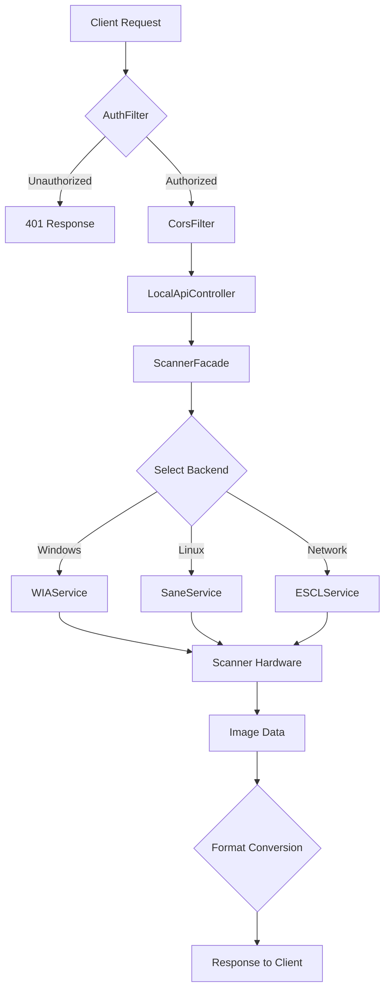

# Pascal Scanning Agent API Documentation

## Base URL
```
http://localhost:17070
```

## Web Interface
- **UI**: `http://localhost:17070/ui`
- **Description**: Modern web interface for scanner management and testing

---

## REST API Endpoints

### 1. Health Check
**GET** `/v1/health`

**Description**: Check if the service is running

**Response**:
```json
{
  "status": "UP",
  "service": "scanner-desktop-client",
  "version": "0.1.0"
}
```

---

### 2. List Scanners
**GET** `/v1/scanners`

**Description**: Get all available scanners (Windows WIA, Linux SANE, Network eSCL)

**Response**:
```json
[
  {
    "id": "WIA_Scanner_123",
    "name": "HP LaserJet Pro MFP M428fdw",
    "devicePath": "/dev/usb/scanner0",
    "connected": true,
    "status": "Available"
  }
]
```

---

### 3. Get Scanner Capabilities
**GET** `/v1/capabilities?scannerId={scannerId}`

**Parameters**:
- `scannerId` (required): Scanner ID from the scanners list

**Response**:
```json
{
  "scannerId": "WIA_Scanner_123",
  "supportedResolutions": [150, 200, 300, 600, 1200],
  "supportedFormats": ["pdf", "jpg", "png", "tiff"],
  "supportedColorModes": ["Color", "Grayscale", "Black and White"],
  "duplexSupported": true,
  "adfSupported": true
}
```

---

### 4. Perform Scan
**POST** `/v1/scan`

**Headers**:
```
Content-Type: application/json
```

**Request Body**:
```json
{
  "scannerId": "WIA_Scanner_123",
  "dpi": 300,
  "colorMode": "Color",
  "paperSize": "A4",
  "format": "pdf",
  "previewOnly": false,
  "outputFileName": "document_scan",
  "duplex": false,
  "adf": false
}
```

**Parameters**:
- `scannerId` (required): Scanner ID from the scanners list
- `dpi` (optional, default: 300): Resolution - 150, 200, 300, 600, 1200
- `colorMode` (optional, default: "Color"): "Color", "Grayscale", "Black and White"
- `paperSize` (optional, default: "A4"): "A4", "Letter", "Legal", etc.
- `format` (optional, default: "pdf"): "pdf", "jpg", "png", "tiff"
- `previewOnly` (optional, default: false): Generate preview only
- `outputFileName` (optional): Custom filename without extension
- `duplex` (optional, default: false): Enable duplex scanning (if supported)
- `adf` (optional, default: false): Use Automatic Document Feeder (if supported)

**Response** (Success):
```json
{
  "status": "SUCCESS",
  "message": "Scan completed successfully",
  "fileName": "document_scan.pdf",
  "fileFormat": "pdf",
  "fileData": "base64EncodedFileContent..."
}
```

**Response** (Error):
```json
{
  "status": "ERROR",
  "message": "Scanner not available",
  "fileName": null,
  "fileFormat": null,
  "fileData": null
}
```

---

## JavaScript Integration Example

```javascript
// Health check
const health = await fetch('http://localhost:17070/v1/health');
const healthData = await health.json();

// Get scanners
const scannersResponse = await fetch('http://localhost:17070/v1/scanners');
const scanners = await scannersResponse.json();

// Get capabilities
const capsResponse = await fetch(`http://localhost:17070/v1/capabilities?scannerId=${scanners[0].id}`);
const capabilities = await capsResponse.json();

// Perform scan
const scanRequest = {
  scannerId: scanners[0].id,
  dpi: 300,
  colorMode: "Color",
  format: "pdf",
  outputFileName: "my_document"
};

const scanResponse = await fetch('http://localhost:17070/v1/scan', {
  method: 'POST',
  headers: {
    'Content-Type': 'application/json'
  },
  body: JSON.stringify(scanRequest)
});

const scanResult = await scanResponse.json();

if (scanResult.status === 'SUCCESS') {
  // Convert base64 to blob and download
  const byteChars = atob(scanResult.fileData);
  const byteNums = new Array(byteChars.length);
  for (let i = 0; i < byteChars.length; i++) {
    byteNums[i] = byteChars.charCodeAt(i);
  }
  const blob = new Blob([new Uint8Array(byteNums)], {
    type: scanResult.format === 'pdf' ? 'application/pdf' : `image/${scanResult.format}`
  });

  // Create download link
  const url = URL.createObjectURL(blob);
  const a = document.createElement('a');
  a.href = url;
  a.download = scanResult.fileName;
  a.click();
  URL.revokeObjectURL(url);
}
```

---

## cURL Examples

### Health Check
```bash
curl http://localhost:17070/v1/health
```

### List Scanners
```bash
curl http://localhost:17070/v1/scanners
```

### Get Capabilities
```bash
curl "http://localhost:17070/v1/capabilities?scannerId=WIA_Scanner_123"
```

### Perform Scan
```bash
curl -X POST http://localhost:17070/v1/scan \
  -H "Content-Type: application/json" \
  -d '{
    "scannerId": "WIA_Scanner_123",
    "dpi": 300,
    "colorMode": "Color",
    "format": "pdf",
    "outputFileName": "test_scan"
  }'
```

---

## Error Codes

| HTTP Status | Description |
|------------|-------------|
| 200 | Success |
| 400 | Bad Request - Invalid parameters |
| 404 | Not Found - Scanner not found |
| 500 | Internal Server Error - Scan failed |

---

## Platform Support

| Platform | Scanner Types | Notes |
|----------|---------------|-------|
| Windows | WIA USB/Network | Requires pascal scanning agent running |
| Linux | SANE USB/Network | Limited support |
| Network | eSCL Protocol | Cross-platform |

---

## Configuration

### Application Properties

The application is configured via `application.properties`:

#### Server Configuration
```properties
server.port=17070
server.address=127.0.0.1
spring.application.name=Pascal Scanning Client
```

#### API Configuration
```properties
# CORS settings
api.cors.allowed-origins=*

# Maximum scan result size (default: 50MB)
api.max-result-size-bytes=52428800

# Optional shared secret for API authentication
# api.auth.shared-secret=your-secret-here
```

#### Scanner Discovery
```properties
# Enable automatic scanner discovery on startup
scanner.startup-discovery.enabled=true
scanner.startup-discovery.delay-seconds=2

# Scanner cache TTL
scanner.cache.ttl-minutes=2
```

#### eSCL Configuration
```properties
# Number of hosts per subnet to probe (starting from .1)
escl.discovery-range=20

# Comma-separated list of known scanner IPs
escl.manual-ips=127.0.0.1,10.198.195.242

# Common ports to probe for eSCL scanners
escl.common.ports=80,443,8080,8443,8181
```

#### WIA Configuration
```properties
# Enable Windows WIA backend (requires native dependencies)
wia.enabled=true
```

#### Autostart Configuration
```properties
# Enable application autostart on system boot
autostart.enabled=true
```

---

## Architecture Overview

### Technology Stack
- **Framework**: Spring Boot 2.5.6
- **Java Version**: 17
- **Build Tool**: Maven
- **PDF Generation**: iText 5.5.10
- **Windows Integration**: JACOB 1.21 (for WIA support)

### Core Components

#### 1. API Layer (`com.lci.scannerdesktop.api`)
- **LocalApiController**: RESTful API endpoints for scanner operations
- **LocalUiController**: Serves the web-based UI
- **ScannerFacade**: Orchestrates scanner discovery and scanning operations
- **AuthFilter**: Optional authentication via shared secret
- **CorsConfig**: Cross-origin resource sharing configuration
- **ScanPolicy**: Enforces scan size limits

#### 2. Scanner Backends

##### WIA Service (`com.lci.scannerdesktop.wia`)
- **Platform**: Windows only
- **Technology**: Uses JACOB (Java-COM Bridge) to interact with Windows Imaging Acquisition
- **Capabilities**: 
  - Discovers USB and network scanners via WIA
  - Supports multiple image formats (BMP, PNG, JPEG, TIFF)
  - Configurable DPI, color mode, and page size
- **Key Classes**:
  - `WIAService`: Main service for WIA operations
  - `JacobBootstrap`: Initializes JACOB native library
  - `WiaConfig`: Configuration for WIA backend

##### SANE Service (`com.lci.scannerdesktop.sane`)
- **Platform**: Linux/Unix
- **Technology**: Interfaces with SANE (Scanner Access Now Easy) daemon
- **Capabilities**:
  - Discovers scanners via `scanimage -L`
  - Executes scans using `scanimage` command-line tool
  - Supports various output formats

##### eSCL Service (`com.lci.scannerdesktop.escl`)
- **Platform**: Cross-platform
- **Technology**: HTTP-based eSCL (AirPrint scanning) protocol
- **Capabilities**:
  - Network scanner discovery via subnet probing
  - Manual IP configuration support
  - RESTful scanner communication
- **Key Classes**:
  - `ESCLService`: Implements eSCL protocol
  - `EsclConfig`: Discovery and connection settings

#### 3. Boot & Lifecycle (`com.lci.scannerdesktop.boot`)
- **AutoStartManager**: Configures OS-specific autostart
  - Windows: Registry entry in `HKCU\Software\Microsoft\Windows\CurrentVersion\Run`
  - macOS: LaunchAgent plist file
  - Linux: XDG autostart desktop entry

### Request Flow



### Scanner Discovery Process

1. **Startup Discovery** (if enabled):
   - Waits configured delay (default 2 seconds)
   - Triggers discovery on all enabled backends
   - Caches results for configured TTL (default 2 minutes)

2. **Backend-Specific Discovery**:
   - **WIA**: Enumerates COM devices via Windows WIA API
   - **SANE**: Executes `scanimage -L` and parses output
   - **eSCL**: 
     - Probes configured manual IPs
     - Scans subnet range (e.g., 192.168.1.1 to .20)
     - Tests common ports (80, 443, 8080, 8443, 8181)
     - Validates eSCL capability via `/eSCL/ScannerCapabilities`

---

## Security

### Authentication

The API supports optional authentication via shared secret:

1. **Configuration**: Set `api.auth.shared-secret` in `application.properties`
2. **Header**: Include `X-Scanner-Secret: <your-secret>` in requests
3. **Exemption**: `/v1/health` endpoint is always accessible without authentication

**Example with authentication**:
```bash
curl -H "X-Scanner-Secret: my-secret-key" http://localhost:17070/v1/scanners
```

### CORS Policy

- **Default**: Allows all origins (`*`)
- **Customization**: Configure via `api.cors.allowed-origins` (comma-separated list)
- **Methods**: All HTTP methods allowed
- **Headers**: All headers allowed

### Network Binding

- **Default**: Binds to `127.0.0.1` (localhost only)
- **Security Note**: Change `server.address` to `0.0.0.0` only in trusted networks

### Size Limits

- **Maximum Result Size**: 50MB (configurable via `api.max-result-size-bytes`)
- **Purpose**: Prevents memory exhaustion from large scans

---

## Building and Running

### Prerequisites
- Java 17 or higher
- Maven 3.6+
- For Windows WIA support: JACOB native library (included in `lib/jacob.jar`)

### Build
```bash
mvn clean package
```

### Run Development Server
```bash
mvn spring-boot:run
```

### Run Production JAR
```bash
java -jar target/scanner-desktop-client.jar
```

### Platform-Specific Notes

#### Windows
- WIA support requires `jacob.dll` in the library path
- Automatically discovers USB scanners via WIA
- Registry autostart configured automatically

#### Linux
- Requires SANE installed: `sudo apt-get install sane sane-utils`
- Test SANE: `scanimage -L`

#### macOS
- eSCL (network scanners) supported
- LaunchAgent configured for autostart

---

## Troubleshooting

### Service Issues

| Issue | Solution |
|-------|----------|
| Service not responding | Ensure Pascal Scanning Agent is running on port 17070 |
| Port already in use | Change `server.port` in `application.properties` |
| Autostart not working | Check OS-specific autostart configuration |

### Scanner Discovery

| Issue | Solution |
|-------|----------|
| No scanners found | Check scanner drivers and USB/network connections |
| WIA scanners not detected | Verify `wia.enabled=true` and JACOB library is loaded |
| SANE scanners not found | Run `scanimage -L` to verify SANE configuration |
| eSCL scanners missing | Add scanner IP to `escl.manual-ips` |

### Scanning Issues

| Issue | Solution |
|-------|----------|
| Scan fails | Verify scanner is not in use by other applications |
| Large scans fail | Increase `api.max-result-size-bytes` |
| Authentication errors | Check `X-Scanner-Secret` header matches configuration |
| CORS errors | Ensure requests come from allowed origins |

### Debugging

Enable debug logging in `application.properties`:
```properties
logging.level.com.lci.scannerdesktop=DEBUG
```

---

## Version: 0.1.0
**Last updated**: 2026-02-04
